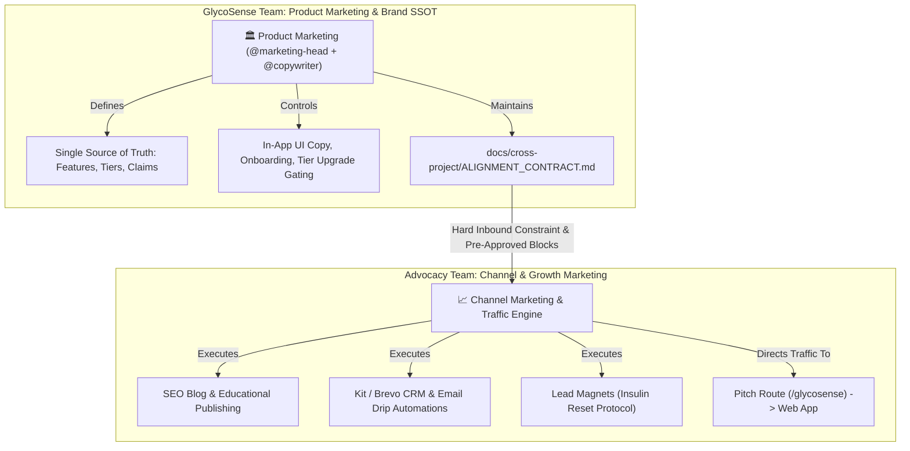

# Cross-Project High-Level Synchronization Protocol

> **Operating Standard for Knowledge & Copywriting Alignment**  
> **GlycoSense Platform:** `/Users/user/dev/projects/nocode/glycosense`  
> **Community Advocacy Platform:** `/Users/user/dev/projects/nocode/diabetessupport-website`  
> **Protocol Lead:** `@liaison` (Cross-Project Advocacy Liaison)  

---

## 1. Context & Operational Philosophy

GlycoSense and the Community Advocacy project (`diabetessupport-website`) are symbiotically linked:
- **GlycoSense** is the core metabolic health product, software application, and local-first clinical decision-support engine.
- **Diabetes Support / DiabetesCare PH** is the community-driven advocacy hub managing user acquisition, lead magnets (e.g. Dr. Bikman Insulin Reset Protocol), customer CRM (Kit / Brevo), marketing campaigns, and educational automations.

Because each project has its own development cadence and technical stack (React/Vite local-first vs Next.js/MongoDB App Router), **their technical implementations remain completely decoupled**. However, their **customer-facing information, claims, feature availability, and copywriting must maintain 100% fidelity** to eliminate confusion, customer mistrust, or regulatory violations.

---

## 2. Marketing Functional Specialization (Eliminating Overlap & Conflict)

To prevent duplication and role conflict between the two projects, the marketing teams operate under strict **Functional Specialization**:



| Domain | GlycoSense Team (Product Marketing) | Advocacy Team (Channel & Growth Marketing) |
|---|---|---|
| **Primary Goal** | Feature adoption, in-app UX clarity, clinical accuracy, and tier monetization | Traffic acquisition, lead generation, audience trust, and community engagement |
| **Deliverables** | In-app UX copy, tier upgrade dialogs, changelogs, feature release briefs, clinical disclaimers | Blog articles, SEO metadata, Kit/Brevo email campaigns, lead magnets, social hooks |
| **Authority** | **Sole Authority** over product capabilities, feature tiers (`FREE`/`PRO`/`PREMIUM`), and clinical claims | **Sole Authority** over email marketing schedules, SEO keyword targeting, and ad campaigns |

---

## 3. Physical Workspace Synchronization Setup

- **GlycoSense Source File**: `docs/cross-project/ALIGNMENT_CONTRACT.md`
- **Partner Target File**: `/Users/user/dev/projects/nocode/diabetessupport-website/docs/GLYCOSENSE_ALIGNMENT_CONTRACT.md`

### Automated Sync Command (managed by `@liaison`):
```bash
# Push contract changes from GlycoSense to Advocacy workspace:
cp docs/cross-project/ALIGNMENT_CONTRACT.md /Users/user/dev/projects/nocode/diabetessupport-website/docs/GLYCOSENSE_ALIGNMENT_CONTRACT.md
```

---

## 4. The 4-Step Bidirectional Sync Workflow

### Flow A: GlycoSense $\longrightarrow$ Community Advocacy Project
*(When GlycoSense adds a feature, adjusts tiers, or changes product copy)*

1. **Trigger**: `@vp-eng` or `@marketing-head` finalizes a customer-facing change.
2. **Clinical Audit**: `@compliance-head` verifies claims, disclaimers, and privacy assertions.
3. **Contract Update & CEO Sign-Off**: `@liaison` updates [`ALIGNMENT_CONTRACT.md`](file:///Users/user/dev/projects/nocode/glycosense/docs/cross-project/ALIGNMENT_CONTRACT.md); Human CEO approves the milestone.
4. **Broadcast to Advocacy**: `@liaison` pushes the contract to the partner workspace, records the entry in [`SYNC_LOG.md`](file:///Users/user/dev/projects/nocode/glycosense/docs/cross-project/SYNC_LOG.md), and notifies the advocacy marketing team.

---

### Flow B: Community Advocacy Project $\longrightarrow$ GlycoSense
*(When the Advocacy Team creates a new lead magnet, needs a new feature hook, or gathers user feedback)*

1. **Trigger**: Advocacy Team submits a request for a new copy angle or reports customer confusion about a feature.
2. **Ingestion & Triage**: `@liaison` captures the request, presents it to `@coo`.
3. **Feasibility & Marketing Review**: `@marketing-head` and `@copywriter` formulate verified copy; `@compliance-head` checks claims.
4. **Response**: `@liaison` provides the approved copy pack to the Advocacy Team.

---

## 5. Cross-Workspace CEO Governance & Conflict Reconciliation Protocol

### The Core Scenario
## 5. Bidirectional Cross-Workspace CEO Governance & Conflict Reconciliation

The CEO operates across both workspaces (`glycosense` and `diabetessupport-website`). The protocol is **100% bidirectional** to prevent either project from drifting, over-promising, or breaking active campaigns.

```mermaid
graph TD
    subgraph Scenario_A ["Direction A: CEO in Advocacy Project"]
        A_DIR["CEO issues directive in diabetessupport-website"] --> A_CHECK["Pre-Flight check against GLYCOSENSE_ALIGNMENT_CONTRACT.md"]
        A_CHECK -->|Drift Detected| A_WARN["Advocacy Agent surfaces heads-up to CEO"]
        A_WARN -->|CEO confirms| A_AUDIT["@liaison audits & detects drift"]
        A_AUDIT --> A_BRIEF["@coo presents 2-Option Reconciliation Brief in GlycoSense"]
    end

    subgraph Scenario_B ["Direction B: CEO in GlycoSense Product"]
        G_DIR["CEO issues directive in GlycoSense (tier change / deprecation)"] --> G_CHECK["@liaison checks Advocacy Dependency Map"]
        G_CHECK -->|Campaign Conflict Detected| G_WARN["@coo surfaces heads-up to CEO before build"]
        G_WARN -->|CEO confirms| G_SYNC["@liaison pushes updated contract to Advocacy workspace"]
        G_SYNC --> G_ACTION["Advocacy team auto-queues migration of pitch page & CRM funnels"]
    end
```



---

### Direction A: CEO Directing in Advocacy Workspace $\longrightarrow$ Reconciled in GlycoSense
*(e.g., CEO launches a new promotional campaign or lead magnet on the advocacy site that mentions new features or claims)*

1. **Pre-Flight Contract Check**:
   - The Advocacy AI Agent checks `docs/GLYCOSENSE_ALIGNMENT_CONTRACT.md`.
   - If your directive touches GlycoSense and requests something outside the contract (e.g., offering a gated feature for free), the Advocacy agent gives a polite heads-up:
     > *"⚠️ CEO Alignment Note: Feature X is currently gated to PRO in GlycoSense. Would you like to update the GlycoSense tier directive first, or highlight our free manual glucose tracking instead?"*
2. **Asynchronous Drift Detection by `@liaison`**:
   - If you confirm the campaign anyway, `@liaison` detects the divergence during periodic audit.
   - `@coo` prepares an **Executive Reconciliation Brief** in `EXECUTIVE_DIRECTIVES.md`:
     > *"In the Advocacy project, Campaign X was approved with Condition Y. GlycoSense is currently at Condition Z. Decision: (A) Adopt in GlycoSense product, or (B) Realign Advocacy copy."*
3. **Sovereign Decision**:
   - If you choose (A), GlycoSense engineering updates the app to match your new vision.
   - If you choose (B), `@liaison` delivers a compliant copy block back to the Advocacy team.

---

### Direction B: CEO Directing in GlycoSense $\longrightarrow$ Reconciled in Advocacy Project
*(e.g., CEO changes tier gates, renames features, updates clinical target ranges, or deprecates tools in GlycoSense)*

1. **Pre-Flight Advocacy Impact Check (Before Execution in GlycoSense)**:
   - When you give an executive directive in GlycoSense (e.g., *"Make the FINDRISC assessment exclusive to PRO"* or *"Update target glucose range to 80–130 mg/dL"*):
   - `@liaison` immediately checks which active marketing pages, lead magnets, and CRM email sequences in `diabetessupport-website` depend on that feature.
   - If a breaking change for live campaigns is detected, `@coo` alerts you **before** code changes are committed:
     > *"⚠️ CEO Impact Alert: Gating FINDRISC to PRO will invalidate the active free lead magnet on the Advocacy website (`diabetessupport.vercel.app/reset-success`). Shall we: (A) Proceed and have `@liaison` deliver an Advocacy Campaign Migration Pack, or (B) Keep FINDRISC free in the contract?"*
2. **Automated Downstream Broadcast to Advocacy Workspace**:
   - When you confirm (A):
     - `@liaison` updates `ALIGNMENT_CONTRACT.md` and `SYNC_LOG.md`.
     - Automatically copies the contract to `/Users/user/dev/projects/nocode/diabetessupport-website/docs/GLYCOSENSE_ALIGNMENT_CONTRACT.md`.
     - Packages a **Campaign Migration Notice** with pre-approved replacement copy.
3. **When You Next Open the Advocacy Workspace**:
   - The Advocacy AI Team immediately greets you with:
     > *"📢 Inbound Product Update: GlycoSense Directive DIR-XXX updated Feature X to PRO. We have already drafted the corresponding updates for `/src/app/glycosense/page.tsx` and the Kit email welcome sequence. Ready for your review to deploy."*
   - Active campaigns are never left promoting outdated features, broken links, or stale pricing.

---

## 6. Summary of Guarantees
- **No Gridlock**: Neither team can block the Human CEO.
- **No Confusion**: Whichever workspace you are working in, the AI agents protect the other workspace from unintended collateral damage.
- **Single Source of Truth**: The `ALIGNMENT_CONTRACT.md` remains the unified anchor that prevents marketing misrepresentation and clinical risk.
