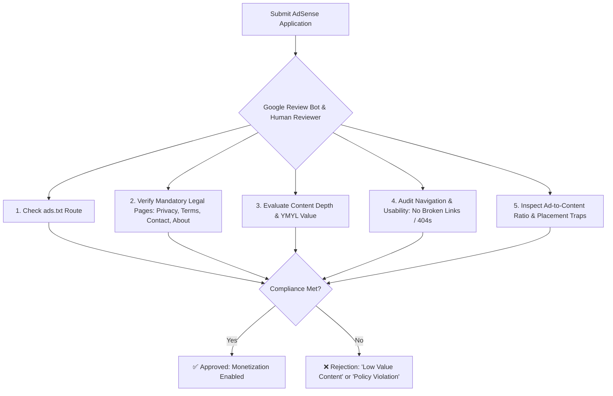
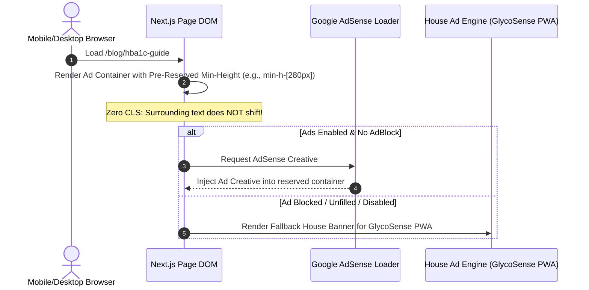
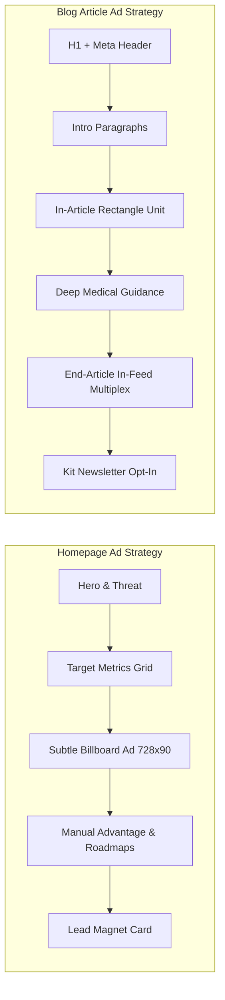

# 💰 Google AdSense Monetization & UI/UX Assessment Report
**Platform:** DiabetesCare PH (`diabetescareph.com`)  
**Stack:** Next.js 16 (App Router), React 19, TypeScript, Tailwind CSS 4, MongoDB  
**Niche:** Healthcare & Medical Education (YMYL) / PWA Health Tracking  
**Assessment Version:** 1.0.0  
**Authors:** Senior UI/UX Architect & Google AdSense Monetization Lead  

---

## 📑 Executive Summary & Monetization Readiness Matrix

To successfully monetize DiabetesCare PH with Google AdSense while preserving a **premium, trust-inducing healthcare user experience (UI/UX)**, the platform must satisfy two interrelated standards:
1. **Google AdSense Program & Webmaster Quality Policies** (Site approval prerequisites, privacy/cookie disclosures, `ads.txt`, ad placement rules, avoidance of accidental clicks, and YMYL content value).
2. **Modern UX/UI Engineering Standards** (Zero Cumulative Layout Shift [CLS], high viewability rates, native design harmony, mobile viewport ergonomics, and balanced conversion between AdSense revenue and owned PWA/email lead generation).

### AdSense & UI/UX Readiness Scorecard

| Assessment Dimension | Current Status | Score | Primary Gaps & Action Items |
| :--- | :---: | :---: | :--- |
| **AdSense Policy & Compliance** | ❌ Deficient | `40 / 100` | Missing dedicated `/privacy-policy` with DART/AdSense disclosures, missing `/terms-of-service`, missing `/about`, missing `/contact`, missing `/ads.txt`. |
| **Ad Architecture & Infrastructure** | ⚠️ Incomplete | `45 / 100` | Config constant exists in `constants.ts`, but no script loader, ad slot components, or fallback handlers exist. |
| **Layout Shift (CLS) Prevention** | ❌ Critical Risk | `35 / 100` | No reserved dimension containers; asynchronous ad injection will cause severe CLS penalties. |
| **Ad Density & Placement UX** | ⚠️ Unconfigured | `50 / 100` | No defined slot map; risk of ad crowding over lead magnet forms or pushing primary H1 titles below the fold on mobile. |
| **House Ads & Fallback Yield** | ❌ Missing | `20 / 100` | When AdBlock is active or ads are un-filled, empty white boxes will appear instead of owned GlycoSense PWA promotional cards. |
| **Mobile UX & Viewability** | ⚠️ Moderate | `60 / 100` | Good responsive layout, but needs strict vertical spacing to prevent accidental clicks near interactive buttons and hamburger menu. |
| **Overall Monetization Readiness** | ⚠️ **NOT READY** | **`41.7 / 100`** | **Requires Architectural Implementation Prior to AdSense Application** |

---

## 1. Google AdSense Approval Prerequisites & Policy Compliance



### 1.1 Mandatory Legal & Compliance Pages (Critical Approval Gateways)

Google human reviewers and automated approval crawlers will immediately reject sites that lack formal transparency and data protection pages:

1. **Dedicated Privacy Policy (`/privacy-policy`)**:
   - **Requirement**: Must explicitly disclose that Google is a third-party vendor that uses cookies (including the DoubleClick DART cookie) to serve ads based on prior visits, and provide links to Google Ad & Content Network Privacy Policy and opt-out options (such as [AboutAds.info](https://optout.aboutads.info/)).
   - **Philippine & International Privacy**: Must integrate Republic Act No. 10173 (Philippine Data Privacy Act), GDPR, and CCPA clauses regarding health metric non-disclosure.
2. **Dedicated Terms of Service (`/terms-of-service`)**:
   - **Requirement**: Comprehensive terms covering educational scope, intellectual property, medical disclaimer limitation of liability, and user conduct.
3. **About Us & Editorial Mission (`/about`)**:
   - **Requirement**: Explains who runs DiabetesCare PH, editorial independence, why the project exists (preventing diabetes complications among Filipino breadwinners), and advisory standards.
4. **Contact & Medical Correction Page (`/contact`)**:
   - **Requirement**: Functional email contact form or direct communication channel for user feedback, copyright inquiries, and clinical corrections.

---

### 1.2 Dynamic `/ads.txt` Route Architecture
* **Issue**: AdSense accounts require an `ads.txt` file at the domain root (`https://diabetescareph.com/ads.txt`) to protect publisher ad inventory from unauthorized domain spoofing.
* **Granular Solution**: Implement a dynamic Next.js App Router route in `src/app/ads.txt/route.ts` that dynamically reads `ADSENSE_CONFIG.publisherId`.

```typescript
// src/app/ads.txt/route.ts
import { NextResponse } from 'next/server';
import { ADSENSE_CONFIG } from '@/config/constants';

/**
 * Dynamic ads.txt Route Handler.
 * @usecase Serves authorized digital sellers verification file for Google AdSense crawlers.
 * @dependencies ADSENSE_CONFIG.
 * @returns {NextResponse} Plain text ads.txt content.
 */
export async function GET(): Promise<NextResponse> {
  const publisherId = ADSENSE_CONFIG.publisherId.replace(/^ca-/, '');
  const adsTxtContent = `# Authorized Digital Sellers for DiabetesCare PH\ngoogle.com, ${publisherId}, DIRECT, f08c47fec0942fa0\n`;

  return new NextResponse(adsTxtContent, {
    status: 200,
    headers: {
      'Content-Type': 'text/plain; charset=utf-8',
      'Cache-Control': 'public, max-age=86400, stale-while-revalidate=604800',
    },
  });
}
```

---

## 2. High-Yield UI/UX Ad Placement Architecture

```mermaid
graph TD
    subgraph Blog Article Page UI Layout
        Header[Sticky App Header] --> Breadcrumbs[Breadcrumb Navigation]
        Breadcrumbs --> Title[Article H1 + Author Byline]
        Title --> LeaderboardAd[Ad Slot 1: Desktop Leaderboard / Mobile Banner 728x90]
        LeaderboardAd --> FeaturedImg[Featured Infographic Image]
        FeaturedImg --> Content1[Intro & Symptoms Paragraphs 1-3]
        Content1 --> MidContentAd[Ad Slot 2: High-CTR In-Article Rectangle 336x280 / Responsive]
        MidContentAd --> Content2[Core Clinical Guidance Paragraphs 4-7]
        Content2 --> EndArticleAd[Ad Slot 3: In-Feed Multiplex / Native Unit]
        EndArticleAd --> LeadMagnet[Owned CTA: Kit Lead Magnet / PWA Download]
        LeadMagnet --> RelatedPosts[Related Educational Articles Grid]
        RelatedPosts --> Footer[Footer + Mandatory Disclaimers & Legal Links]
    end
```



### 2.1 Ad Slot Design & UX Rules

1. **Clear Visual Demarcation ("Advertisement" Label)**:
   - Google strictly forbids misleading ad placements that look identical to site navigation or editorial buttons.
   - Every ad container must feature a subtle, standardized label:
     ```html
     <span class="text-[10px] font-bold uppercase tracking-widest text-slate-400 block text-center mb-1">
       Advertisement
     </span>
     ```
2. **Buffer Spacing & Accidental Click Traps**:
   - Maintain a minimum of `24px` to `32px` vertical margin between ad units and interactive UI elements (e.g. "Subscribe", "Read More", or modal triggers).
   - Never place ads directly beneath mobile hamburger drawer menus.
3. **Ad Density Cap (Value of Inventory Policy)**:
   - Content must always exceed ad real estate on every viewport fold.
   - For an 800-word article: Maximum **2 to 3 in-content ad units** + 1 bottom multiplex/recommendation unit.

---

## 3. Zero-CLS (Cumulative Layout Shift) & Fallback Engineering



### 3.1 Fallback House Ads (Self-Monetization Engine)

When an ad slot fails to load (due to AdBlockers, network latency, or unfilled inventory), displaying a blank white box degrades UX and loses monetization potential. Instead, the container automatically transitions into a **high-converting House Ad promoting the GlycoSense PWA or Free 7-Day PDF Cheatsheet**.

---

## 4. Granular Component Implementation Blueprint

### 4.1 Global AdSense Script Component (`src/components/ads/AdSenseScript.tsx`)

```tsx
'use client';

import Script from 'next/script';
import { ADSENSE_CONFIG } from '@/config/constants';

/**
 * Client component to safely load Google AdSense script asynchronously.
 * @usecase Injects the official Google AdSense script after interactive page load.
 * @dependencies Next.js Script component, ADSENSE_CONFIG.
 */
export default function AdSenseScript() {
  if (!ADSENSE_CONFIG.enabled || !ADSENSE_CONFIG.publisherId || ADSENSE_CONFIG.publisherId === 'ca-pub-0000000000000000') {
    return null;
  }

  return (
    <Script
      id="adsbygoogle-init"
      strategy="afterInteractive"
      src={`https://pagead2.googlesyndication.com/pagead/js/adsbygoogle.js?client=${ADSENSE_CONFIG.publisherId}`}
      crossOrigin="anonymous"
    />
  );
}
```

---

### 4.2 Reusable Zero-CLS Ad Unit (`src/components/ads/AdUnit.tsx`)

```tsx
'use client';

import React, { useEffect, useRef, useState } from 'react';
import Link from 'next/link';
import { ADSENSE_CONFIG } from '@/config/constants';

export interface AdUnitProps {
  slotId: string;
  format?: 'auto' | 'fluid' | 'rectangle' | 'horizontal';
  responsive?: boolean;
  className?: string;
  fallbackType?: 'pwa' | 'cheatsheet';
}

/**
 * Zero-CLS Responsive Google AdSense Unit with Integrated House Ad Fallback.
 *
 * @usecase Renders AdSense ad slot with geometry reservation to eliminate layout shifts; renders fallback promotion when ads are un-filled.
 * @param {AdUnitProps} props Ad slot identifier, format, and fallback style.
 * @dependencies ADSENSE_CONFIG, React useEffect.
 * @returns {JSX.Element} Rendered ad unit or house fallback promotion.
 */
export default function AdUnit({
  slotId,
  format = 'auto',
  responsive = true,
  className = '',
  fallbackType = 'pwa',
}: AdUnitProps) {
  const adRef = useRef<HTMLModElement | null>(null);
  const [adFailed, setAdFailed] = useState(false);

  useEffect(() => {
    if (!ADSENSE_CONFIG.enabled || ADSENSE_CONFIG.publisherId === 'ca-pub-0000000000000000') {
      setAdFailed(true);
      return;
    }

    try {
      if (typeof window !== 'undefined') {
        ((window as any).adsbygoogle = (window as any).adsbygoogle || []).push({});
      }
    } catch (err) {
      console.warn('AdSense push error or AdBlocker detected:', err);
      setAdFailed(true);
    }
  }, [slotId]);

  // House Ad Fallback Component
  if (adFailed || !ADSENSE_CONFIG.enabled) {
    if (fallbackType === 'cheatsheet') {
      return (
        <div className={`my-8 p-5 bg-gradient-to-r from-amber-50 to-orange-50 border border-amber-200 rounded-2xl shadow-sm text-center space-y-3 ${className}`}>
          <span className="text-[10px] font-extrabold uppercase tracking-widest text-amber-800 bg-amber-100 px-2.5 py-0.5 rounded-full border border-amber-300">
            Free Patient Resource
          </span>
          <h4 className="text-base sm:text-lg font-bold text-slate-900">
            Download the 7-Day Diabetes Action Plan & Sensitivity Cheatsheet PDF
          </h4>
          <p className="text-xs text-slate-600 max-w-lg mx-auto">
            Practical morning habits, low-GI Filipino meal swaps, and printable glucose tracking logs.
          </p>
          <div>
            <Link
              href="/guides/cheatsheet"
              className="inline-block bg-amber-600 hover:bg-amber-700 text-white text-xs font-bold px-5 py-2.5 rounded-xl shadow transition-colors"
            >
              Get Free PDF Download &rarr;
            </Link>
          </div>
        </div>
      );
    }

    return (
      <div className={`my-8 p-5 bg-gradient-to-r from-indigo-900 via-purple-900 to-pink-900 text-white rounded-2xl shadow-md text-center space-y-3 border border-white/10 ${className}`}>
        <span className="text-[10px] font-extrabold uppercase tracking-widest text-pink-200 bg-white/10 px-2.5 py-0.5 rounded-full border border-white/20">
          Smart Health Companion
        </span>
        <h4 className="text-base sm:text-lg font-extrabold text-white">
          GlycoSense — Track Glucose & Protect Your Family&apos;s Future
        </h4>
        <p className="text-xs text-purple-200 max-w-lg mx-auto">
          Turn cost-efficient finger-prick logs and blood pressure checks into clear, doctor-ready health trends.
        </p>
        <div>
          <Link
            href="/#campaign"
            className="inline-block bg-white text-indigo-950 hover:bg-pink-100 text-xs font-black px-5 py-2.5 rounded-xl shadow-lg transition-all"
          >
            Explore GlycoSense Free &rarr;
          </Link>
        </div>
      </div>
    );
  }

  // Active Google AdSense Slot with Geometry Reservation
  return (
    <div className={`my-8 w-full overflow-hidden text-center min-h-[280px] flex flex-col justify-center items-center ${className}`}>
      <span className="text-[10px] font-bold uppercase tracking-widest text-slate-400 block mb-1.5 select-none">
        Advertisement
      </span>
      <div className="w-full bg-slate-50 border border-slate-200/80 rounded-2xl p-2 min-h-[250px] flex items-center justify-center">
        <ins
          ref={adRef}
          className="adsbygoogle block w-full"
          style={{ display: 'block', minHeight: '250px' }}
          data-ad-client={ADSENSE_CONFIG.publisherId}
          data-ad-slot={slotId}
          data-ad-format={format}
          data-full-width-responsive={responsive ? 'true' : 'false'}
        />
      </div>
    </div>
  );
}
```

---

## 5. UI/UX Layout Integration Strategy Across Core Routes



### 5.1 Route-by-Route Integration Map

| Page Route | Recommended Ad Units | Slot Dimensions | UX & CLS Safeguard |
| :--- | :--- | :--- | :--- |
| **Homepage (`/`)** | 1 Horizontal Billboard between *CoreMetricsSection* and *ManualAdvantageSection*. | `728x90` (Desktop) / `320x100` (Mobile) | Placed after vital medical metrics to ensure educational primacy. |
| **Blog Post (`/blog/[slug]`)** | **Unit 1:** Mid-Article in [`BlogPostContent.tsx`](file:///Users/user/dev/projects/nocode/diabetessupport-website/src/components/BlogPostContent.tsx) (after paragraph 3).<br>**Unit 2:** End-of-Article above newsletter opt-in. | `336x280` or Responsive Fluid | Auto-injected with `min-h-[280px]` reservation. Labelled with "Advertisement". |
| **Blog Feed (`/blog`)** | 1 In-Feed Native Card between 3rd and 4th article card. | Native Grid Card Match | Styled with identical border radius and shadow to match article cards while displaying "Sponsored" badge. |
| **Guides (`/guides/cheatsheet`)** | **Zero AdSense Units** (Pure Conversion Lead Magnet Page). | None | Ads omitted to achieve maximum email lead capture conversion. |
| **Owner Landing Pages (`/[slug]`)** | **Zero AdSense Units** (Dedicated marketing funnels). | None | Omitted to prevent distraction from primary Kit opt-in forms. |

---

## 6. Pre-Submission AdSense Approval Checklist

Execute this checklist before submitting `diabetescareph.com` to Google AdSense:

- [ ] **1. Create `/ads.txt` route**: Returns `google.com, pub-XXXXXXXXXXXXXXXX, DIRECT, f08c47fec0942fa0`.
- [ ] **2. Publish `/privacy-policy`**: Includes DoubleClick DART cookie clause, user opt-out links, and RA 10173 data privacy compliance.
- [ ] **3. Publish `/terms-of-service`**: Contains intellectual property, SaMD regulatory safe harbor, and limitation of liability clauses.
- [ ] **4. Publish `/about`**: Establishes health awareness mission, editorial advisory board, and contact transparency.
- [ ] **5. Publish `/contact`**: Dedicated contact route with feedback channels.
- [ ] **6. Update Footer Navigation**: Ensure all legal and transparency pages are permanently linked in the root footer across every route.
- [ ] **7. Verify Article Word Count & Value**: Confirm that at least 15-20 in-depth articles (>600 words each) are published and indexed.
- [ ] **8. Test AdBlock & Fallback Rendering**: Verify that disabling ads or triggering AdBlock gracefully displays GlycoSense house banners with zero broken layouts.
- [ ] **9. Run Lighthouse & Mobile Ergonomics Test**: Ensure mobile touch targets are at least `48x48px` and no ad overlays primary navigation.
