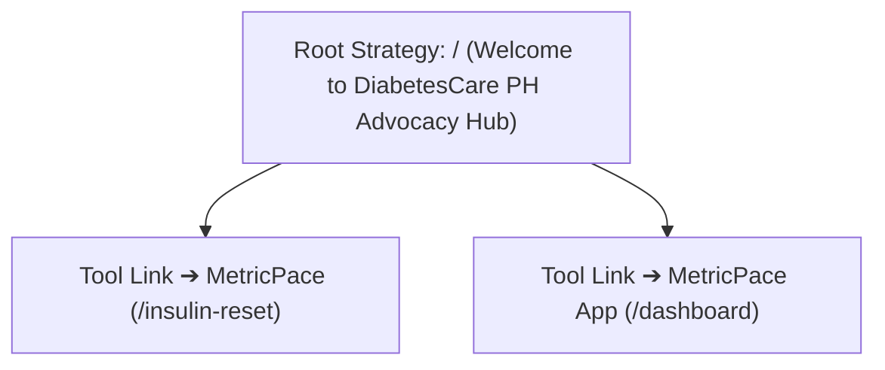

# 📄 BRAND REPOSITIONING & REBRANDING STRATEGY
**Document ID:** `BRD-2026-V1`  
**Project Context:** Transition from direct product pitch to a community-focused domain architecture on `diabetessupport.vercel.app`.  
**Objective:** Deprecate a name with market overlap to establish a non-clinical, unique daily lifestyle companion that compliments healthcare providers rather than competing with traditional medical terms.  

---

## 🧭 SECTION 1: Core Strategic Rationale

In the modern digital health and diagnostic landscape, enterprise branding faces a massive shift. Consumer friction spikes when an application uses dense medical vocabulary (e.g., *Glyco-*, *Cardio-*, *Dia-*, *Clin-*), as these prefixes carry a heavy, sterile, and intimidating psychological association. Furthermore, competing inside these clinical naming spaces triggers immediate domain saturation, strict regulatory scrutiny, and high trademark friction against massive pharmaceutical and device ecosystems.

Our app operates on an assistive, lifestyle-first companion blueprint. Its feature framework is comprehensive, balancing raw quantitative data processing with community support:

1. **Quantitative Ledgers:** Blood glucose logging, meal metrics, weight/BMI calculation, blood pressure tracking, and medication records.
2. **Visual Analytics:** 7, 14, and 30-day graphical charts plotting glucose trends, weight velocity, and circulatory pressure spikes.
3. **Preventative Guardrails:** Automated FINDRISC evaluation, an interactive meal planner, educational libraries, and a thread-style community forum.

### The Collaborative Directive
To minimize consumer resistance and optimize organic distribution, our identity must position itself as a supportive, non-prescriptive daily ally. The brand must signal to traditional doctors and clinical teams that we are a helpful data-collection resource for the patient at home, rather than an automated diagnostic replacement.

---

## 🎯 SECTION 2: The Primary Identity Candidate

### 🏆 Option 1: MetricPace (Preferred Choice)

* **The Etymology:** A deliberate compound joining **"Metric"** (the quantitative tracking of daily vital logs, BMI shifts, and circulatory trends) with **"Pace"** (the steady, maintainable, lifestyle rhythm of health).
* **The Strategic Positioning:** This identity strips away the cold anxiety of disease management and transforms it into a sustainable habit loop. It communicates that tracking numbers is not a high-stress medical chore, but a calm routine managed safely at your own speed.

### 📈 Core Architecture & Asset Mapping
* **Brand Essence:** *"Your daily health vitals, managed at your own pace."*
* **Feature Alignment:**
  * **The Metric Engine:** Handles the logs for glucose, blood pressure, weight tracker, and medication schedules.
  * **The Pace Graph:** Maps out the 7 to 30-day visual charts so users can watch their recovery trends over time.
  * **The Core Library:** Feeds the FINDRISC risk calculator, meal template engines, and community forum updates.
* **Traditional SEO & AEO Impact:** This name carries an exceptionally clean profile across global registries. Because it steers completely clear of medical industry buzzwords, it incurs zero trademark friction. AI Answer Engines (AEO) can cleanly categorize it as a lifestyle management platform, ensuring high domain authority without competing directly with diagnostic hospital software.

---

## 🔄 SECTION 3: Alternative Brand Identity Candidates

If secondary positioning vectors are needed during deployment, two alternative naming systems provide excellent non-competing options:

### 🏠 Alternative A: HearthTally
* **The Etymology:** A warm pairing of **"Hearth"** (the traditional core of the household, family protection, and cooking wholesome meals) with **"Tally"** (a clean, non-clinical term for maintaining an ongoing, accurate record).
* **The Strategic Positioning:** This name anchors itself heavily on the Family Provider & Breadwinner persona. It explicitly reframes health tracking as an act of household stewardship and wealth preservation. It positions the application as a gentle domestic ledger for managing family vitality rather than a sterile clinical log sheet.
* **Brand Essence:** *"A home tracker to protect family wellness."*

### 👥 Alternative B: KinVitals
* **The Etymology:** A combination of **"Kin"** (representing community networks, family structures, and our built-in thread discussion forums) with **"Vitals"** (the essential markers of circulatory and metabolic health).
* **The Strategic Positioning:** This alternative emphasizes the communal and supportive nature of the platform. It treats diabetes protection as a collaborative team effort rather than an isolating, lonely medical struggle. It fits seamlessly alongside the DiabetesCare PH advocacy identity, serving as the practical tool designed for groups who care for one another.
* **Brand Essence:** *"Tracking your body's vitals for the ones who matter most."*

---

## 🛠️ SECTION 4: Engineering Implementation Blueprint

Instruct your AI Developer Agents to substitute all previous brand variables within your code repository using this updated architecture map:

1. **Global Variable Swap:** Replace all previous tracking dashboard product mentions across the codebase, meta-headers, JSON-LD schema layouts, and landing pages with `MetricPace`.
2. **App Interface Alignment:** Update the navbar components inside `src/app/dashboard/` to read *"MetricPace Ledger"* or *"MetricPace Trends Hub"* to solidify the calm, lifestyle-first branding approach.
