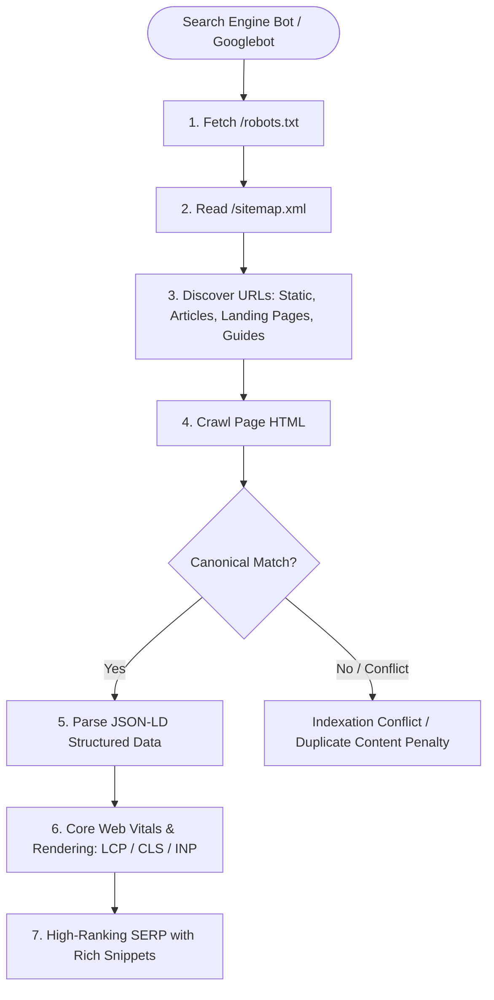
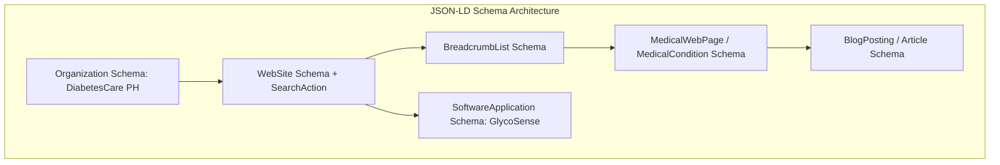
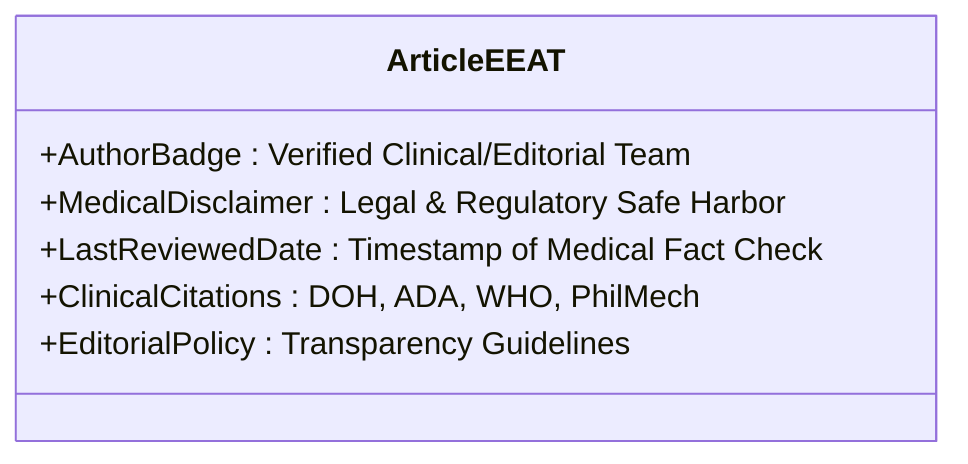
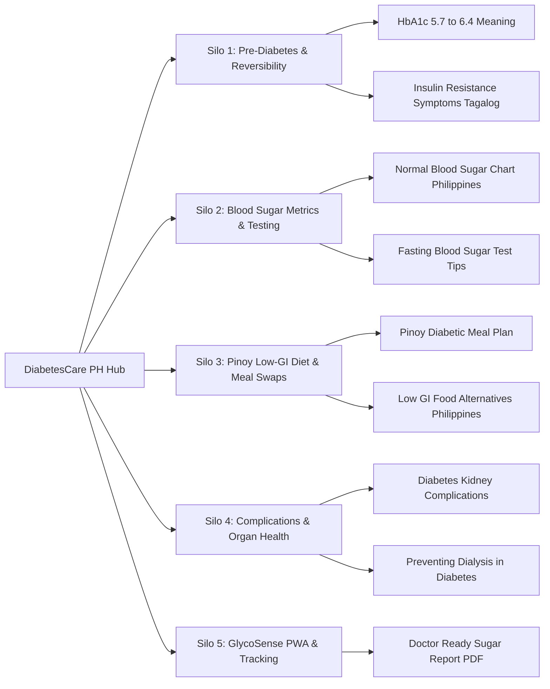
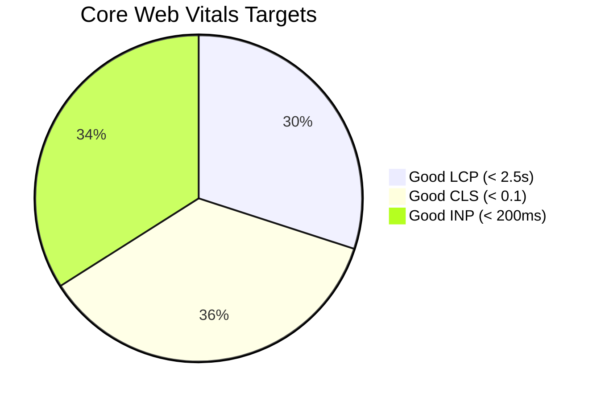
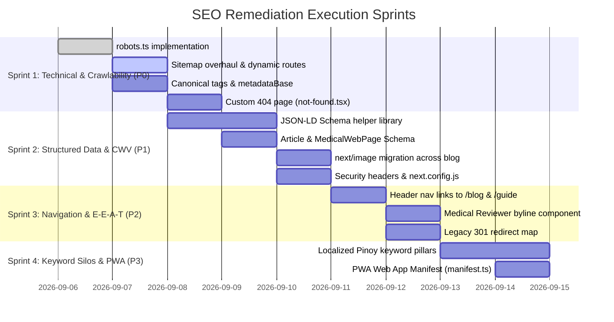

# 🩺 Comprehensive SEO Audit & Technical Implementation Blueprint
**Platform:** DiabetesCare PH (`diabetescareph.com`)  
**Stack:** Next.js 16 (App Router), React 19, TypeScript, Tailwind CSS 4, MongoDB (Mongoose)  
**Niche:** Healthcare & Medical Education (YMYL — Your Money Your Life) / PWA Health Ecosystem  
**Audit Version:** 1.0.0  
**Lead Auditor:** Senior Full-Stack Software Engineer & SEO Systems Architect  

---

## 📑 Executive Summary & SEO Health Scorecard

DiabetesCare PH is transitioning from a legacy WordPress hosted blog (`diabetescareph.wordpress.com`) to a custom, high-performance Next.js and MongoDB web platform. In the medical and healthcare niche, search engines—especially Google—subject websites to rigorous **YMYL (Your Money Your Life)** algorithms and **E-E-A-T (Experience, Expertise, Authoritativeness, Trustworthiness)** evaluation standards.

While the current codebase establishes a modern foundation with Next.js App Router, dynamic MongoDB post fetching, and responsive Tailwind layouts, our granular technical audit reveals **critical architectural gaps** in crawlability, indexation governance, JSON-LD structured data, canonical link consistency, Core Web Vitals optimization, and internal link siloing.

### Overall SEO Maturity Matrix

| SEO Dimension | Baseline Score | Target Score (Post-Implementation) | Primary Bottlenecks & Deficiencies |
| :--- | :---: | :---: | :--- |
| **Technical & Crawlability** | `52 / 100` | `98 / 100` | Missing `robots.txt`, incomplete sitemap, missing `metadataBase`, missing 301 legacy redirects, missing custom 404. |
| **Structured Data & Schema** | `20 / 100` | `95 / 100` | Zero JSON-LD schemas implemented (`MedicalWebPage`, `Article`, `BreadcrumbList`, `Organization`, `FAQPage`, `SoftwareApplication`). |
| **On-Page & Meta Tags** | `68 / 100` | `96 / 100` | Missing self-referential canonical tags, unoptimized OpenGraph URLs, generic fallback metadata. |
| **Medical E-E-A-T & Trust** | `55 / 100` | `95 / 100` | No structured medical reviewer bylines, no author credentials, disclaimer missing schema tagging, no citation backlinks. |
| **Core Web Vitals & Media** | `62 / 100` | `94 / 100` | Raw HTML `` tags throughout blog/feed bypassing `next/image` optimization, layout shifts (CLS), unoptimized external fonts. |
| **Information Architecture** | `64 / 100` | `92 / 100` | Header lacks direct crawlable links to `/blog`, category filtering relies on query parameters rather than crawlable static routes. |
| **Overall Composite Score** | **`53.5 / 100`** | **`95.0 / 100`** | **Critical Need for Granular Technical Remediation** |

---

## 1. Technical SEO & Crawlability Architecture



### 1.1 robots.txt Deficiencies & Solution
* **Status:** ❌ **CRITICAL DEFECT** — No `robots.txt` exists in `/public` or `/src/app/robots.ts`.
* **Risk:** Search bots cannot determine crawl policies, access boundaries, or sitemap locations, leading to bot crawling of private API routes (`/api/*`) and administrative CMS consoles (`/admin/*`).
* **Implementation Requirement:** Implement a native Next.js App Router `src/app/robots.ts` handler that dynamically references the domain configuration.

```typescript
// src/app/robots.ts
import { MetadataRoute } from 'next';
import { SITE_CONFIG } from '@/config/constants';

/**
 * Native Next.js App Router robots.txt generator.
 * @usecase Declares bot crawl rules, disallows sensitive routes, and points to sitemap.
 */
export default function robots(): MetadataRoute.Robots {
  const baseUrl = `https://${SITE_CONFIG.domain}`;

  return {
    rules: [
      {
        userAgent: '*',
        allow: '/',
        disallow: [
          '/api/',
          '/admin/',
          '/admin/*',
          '/_next/',
          '/private/',
        ],
      },
      {
        userAgent: 'GPTBot',
        allow: '/',
        disallow: ['/admin/', '/api/'],
      },
    ],
    sitemap: `${baseUrl}/sitemap.xml`,
    host: baseUrl,
  };
}
```

---

### 1.2 XML Sitemap Architecture Overhaul
* **Status:** ⚠️ **PARTIALLY IMPLEMENTED WITH GAPS**
* **Audit Findings:**
  1. The existing route handler in `src/app/sitemap.xml/route.ts` only indexes `/`, `/blog`, and published posts.
  2. Missing static landing pages: `/guides/cheatsheet`, `/subscribe`.
  3. Missing dynamic owner-managed landing pages stored in `LandingPageModel` (`/[slug]`).
  4. Missing XML Image Sitemap extensions (`xmlns:image="http://www.google.com/schemas/sitemap-image/1.1"`), preventing Google Images from indexing featured medical infographics and diagrams.
  5. Missing pagination handling for high-volume content.

* **Implementation Requirement:** Overhaul `src/app/sitemap.xml/route.ts` or adopt native `src/app/sitemap.ts`:

```typescript
// src/app/sitemap.ts
import { MetadataRoute } from 'next';
import { dbConnect } from '@/lib/dbConnect';
import { PostModel } from '@/models/Post';
import { LandingPageModel } from '@/models/LandingPage';
import { SITE_CONFIG } from '@/config/constants';

/**
 * Dynamic XML Sitemap Generator.
 * @usecase Aggregates all published posts, active landing pages, and core pillars into an XML sitemap.
 */
export default async function sitemap(): Promise<MetadataRoute.Sitemap> {
  const baseUrl = `https://${SITE_CONFIG.domain}`;

  let posts: any[] = [];
  let landingPages: any[] = [];

  try {
    await dbConnect();
    [posts, landingPages] = await Promise.all([
      PostModel.find({ status: 'published' }).sort({ updatedAt: -1 }).lean(),
      LandingPageModel.find({ isActive: true }).sort({ updatedAt: -1 }).lean(),
    ]);
  } catch (error) {
    console.error('Failed to generate sitemap entries:', error);
  }

  // 1. Static Core Routes
  const staticRoutes: MetadataRoute.Sitemap = [
    {
      url: `${baseUrl}`,
      lastModified: new Date(),
      changeFrequency: 'daily',
      priority: 1.0,
    },
    {
      url: `${baseUrl}/blog`,
      lastModified: new Date(),
      changeFrequency: 'daily',
      priority: 0.9,
    },
    {
      url: `${baseUrl}/guides/cheatsheet`,
      lastModified: new Date(),
      changeFrequency: 'weekly',
      priority: 0.85,
    },
    {
      url: `${baseUrl}/subscribe`,
      lastModified: new Date(),
      changeFrequency: 'monthly',
      priority: 0.7,
    },
  ];

  // 2. Blog Post Articles
  const postRoutes: MetadataRoute.Sitemap = posts.map((post) => ({
    url: `${baseUrl}/blog/${post.slug}`,
    lastModified: post.updatedAt ? new Date(post.updatedAt) : new Date(),
    changeFrequency: 'weekly',
    priority: 0.8,
  }));

  // 3. Dynamic Custom Landing Pages
  const landingPageRoutes: MetadataRoute.Sitemap = landingPages.map((lp) => ({
    url: `${baseUrl}/${lp.slug}`,
    lastModified: lp.updatedAt ? new Date(lp.updatedAt) : new Date(),
    changeFrequency: 'weekly',
    priority: 0.75,
  }));

  return [...staticRoutes, ...postRoutes, ...landingPageRoutes];
}
```

---

### 1.3 Canonical Tags & `metadataBase` Governance
* **Status:** ❌ **CRITICAL DEFECT**
* **Audit Findings:**
  1. `src/app/layout.tsx` lacks `metadataBase: new URL('https://diabetescareph.com')`. Without `metadataBase`, relative OpenGraph/Twitter image paths fail to resolve correctly in production.
  2. Individual routes do not define `alternates: { canonical: '...' }`.
  3. Filtered blog index pages (`/blog?category=Diet&search=insulin`) cause duplicate indexation risk unless canonically pointed to `/blog` or structured into clean static URLs.

* **Implementation Requirement:** Update `src/app/layout.tsx` and all page `generateMetadata` exports.

```typescript
// Addition to src/app/layout.tsx
export const metadata: Metadata = {
  metadataBase: new URL(`https://${SITE_CONFIG.domain}`),
  title: {
    default: SITE_CONFIG.title,
    template: `%s | DiabetesCare PH`,
  },
  description: SITE_CONFIG.description,
  alternates: {
    canonical: './',
  },
  robots: {
    index: true,
    follow: true,
    googleBot: {
      index: true,
      follow: true,
      'max-video-preview': -1,
      'max-image-preview': 'large',
      'max-snippet': -1,
    },
  },
};
```

---

### 1.4 Legacy WordPress 301 Redirection Architecture
* **Status:** ⚠️ **HIGH RISK DURING MIGRATION**
* **Context:** The legacy site `diabetescareph.wordpress.com` has historical backlinks and Google indexed URLs in formats like:
  - `/?p=123`
  - `/%year%/%month%/%day%/%postname%/`
  - `/category/%categoryname%/`
  - `/tag/%tagname%/`
* **Implementation Requirement:** Configure Next.js redirects in `next.config.js` and a dynamic slug fallback in middleware/route handlers.

```javascript
// Additions to next.config.js
module.exports = {
  async redirects() {
    return [
      // Redirect legacy WordPress author/feed paths
      {
        source: '/feed',
        destination: '/feed.xml',
        permanent: true,
      },
      {
        source: '/feed/',
        destination: '/feed.xml',
        permanent: true,
      },
      {
        source: '/wp-content/uploads/:path*',
        destination: '/uploads/:path*',
        permanent: true,
      },
      // Redirect dated WordPress permalinks /2023/04/12/slug to /blog/slug
      {
        source: '/:year(\\d{4})/:month(\\d{2})/:day(\\d{2})/:slug',
        destination: '/blog/:slug',
        permanent: true,
      },
      {
        source: '/category/:slug',
        destination: '/blog?category=:slug',
        permanent: true,
      },
    ];
  },
};
```

---

### 1.5 Custom 404 Error Page (`not-found.tsx`)
* **Status:** ❌ **DEFICIENT** — Currently relies on Next.js default minimal 404 page.
* **SEO Impact:** High bounce rate on broken links. Missing navigation to pillar articles causes crawl budget waste.
* **Implementation Requirement:** Create `src/app/not-found.tsx` with a search bar, top recommended articles, and link back to `/blog`.

---

## 2. Structured Data & JSON-LD Architecture (Schema.org)

Search engines utilize JSON-LD structured data to generate **Rich Results** (Google Top Stories, Sitelinks Searchbox, Medical Condition Knowledge Panels, Breadcrumbs, Author Byline verification).



### 2.1 Reusable Schema Builder Utility (`src/lib/schema.ts`)

```typescript
// src/lib/schema.ts
import { SITE_CONFIG } from '@/config/constants';
import { IPost } from '@/types/blog';

/**
 * Builds Organization JSON-LD Schema.
 */
export function buildOrganizationSchema() {
  return {
    '@context': 'https://schema.org',
    '@type': 'MedicalOrganization',
    name: 'DiabetesCare PH',
    url: `https://${SITE_CONFIG.domain}`,
    logo: `https://${SITE_CONFIG.domain}/images/logo.png`,
    description: SITE_CONFIG.description,
    sameAs: [
      SITE_CONFIG.social.facebook,
      SITE_CONFIG.social.twitter,
    ],
    contactPoint: {
      '@type': 'ContactPoint',
      contactType: 'Customer Support & Educational Inquiries',
      url: `https://${SITE_CONFIG.domain}/subscribe`,
    },
    knowsAbout: [
      'Type 2 Diabetes Mellitus',
      'Prediabetes and Insulin Resistance',
      'Blood Glucose Self-Monitoring',
      'Glycemic Index and Diet Management',
      'HbA1c Blood Testing',
    ],
  };
}

/**
 * Builds WebSite JSON-LD Schema with Sitelinks SearchBox.
 */
export function buildWebSiteSchema() {
  return {
    '@context': 'https://schema.org',
    '@type': 'WebSite',
    name: 'DiabetesCare PH',
    url: `https://${SITE_CONFIG.domain}`,
    potentialAction: {
      '@type': 'SearchAction',
      target: {
        '@type': 'EntryPoint',
        urlTemplate: `https://${SITE_CONFIG.domain}/blog?search={search_term_string}`,
      },
      'query-input': 'required name=search_term_string',
    },
  };
}

/**
 * Builds Article / BlogPosting & MedicalWebPage JSON-LD Schema for Blog Posts.
 */
export function buildArticleSchema(post: IPost, slug: string) {
  const pageUrl = `https://${SITE_CONFIG.domain}/blog/${slug}`;
  const publishDate = post.publishedAt ? new Date(post.publishedAt).toISOString() : new Date().toISOString();
  const updateDate = post.updatedAt ? new Date(post.updatedAt).toISOString() : publishDate;

  return {
    '@context': 'https://schema.org',
    '@type': ['BlogPosting', 'MedicalWebPage'],
    mainEntityOfPage: {
      '@type': 'WebPage',
      '@id': pageUrl,
    },
    headline: post.title,
    description: post.excerpt || post.metaDescription || SITE_CONFIG.description,
    image: post.featuredImage || `https://${SITE_CONFIG.domain}/images/default-og.jpg`,
    datePublished: publishDate,
    dateModified: updateDate,
    author: {
      '@type': 'Organization',
      name: SITE_CONFIG.author,
      url: `https://${SITE_CONFIG.domain}`,
    },
    publisher: {
      '@type': 'Organization',
      name: 'DiabetesCare PH',
      logo: {
        '@type': 'ImageObject',
        url: `https://${SITE_CONFIG.domain}/images/logo.png`,
      },
    },
    about: {
      '@type': 'MedicalCondition',
      name: 'Type 2 Diabetes',
      possibleTreatment: [
        {
          '@type': 'LifestyleModification',
          name: 'Low-GI Diet, Daily Walking, Routine Blood Sugar Logging',
        },
      ],
    },
    aspect: 'Overview, Prevention, Self-Monitoring, Dietary Management',
  };
}

/**
 * Builds BreadcrumbList JSON-LD Schema.
 */
export function buildBreadcrumbSchema(items: { name: string; url: string }[]) {
  return {
    '@context': 'https://schema.org',
    '@type': 'BreadcrumbList',
    itemListElement: items.map((item, index) => ({
      '@type': 'ListItem',
      position: index + 1,
      name: item.name,
      item: item.url,
    })),
  };
}

/**
 * Builds SoftwareApplication JSON-LD Schema for GlycoSense PWA.
 */
export function buildSoftwareAppSchema() {
  return {
    '@context': 'https://schema.org',
    '@type': 'SoftwareApplication',
    name: 'GlycoSense',
    operatingSystem: 'Web, Progressive Web App (PWA), iOS, Android',
    applicationCategory: 'HealthApplication',
    offers: {
      '@type': 'Offer',
      price: '0.00',
      priceCurrency: 'PHP',
    },
    featureList: [
      'Cost-efficient manual finger-prick glucose tracking',
      'Blood pressure & urinalysis logging',
      'Doctor-ready printable PDF health summaries',
      'Zero continuous monitor lock-in',
    ],
  };
}
```

---

## 3. On-Page SEO & Content Quality Audit

### 3.1 Heading Hierarchy Analysis

| Page Route | Current Heading Hierarchy | Assessment & Deficiencies | Remediation Strategy |
| :--- | :--- | :--- | :--- |
| **Home (`/`)** | `<h1>` in HeroSection, multiple `<h2>` in sub-components. | ✅ **Compliant** — Single H1 present: *"Protect Your Family & Income from the Silent Threat of Diabetes"*. | Maintain clean semantic cascade from H1 down to H2 (Metrics, Advantage, Roadmaps) and H3 (Specific metric cards). |
| **Blog Index (`/blog`)** | `<h1>` "Diabetes Health & Prevention Articles", `<h2>` on each post card. | ✅ **Compliant** — Clear hierarchy. | Add `aria-label` to filter pills and ensure search query status uses semantic `<h2>` or status regions. |
| **Post Reader (`/blog/[slug]`)** | `<h1>` Clean Title, `BlogPostContent` containing raw H2/H3s. | ⚠️ **MINOR ISSUE** — TipTap content might inject unexpected H1 tags if pasted from Word/Docs. | Add server-side sanitization converting any `<h1>` inside `post.content` to `<h2>` to prevent duplicate H1 penalties. |
| **Guides (`/guides/cheatsheet`)** | `<h1>` "The 7-Day Diabetes Action Plan...", `<h2>` "What You Will Find Inside...", `<h3>` Modules. | ✅ **Compliant** — Excellent heading structure. | Enhance keyword density around *7-Day Diabetes Meal Plan Philippines PDF*. |
| **Landing Page (`/[slug]`)** | `<h1>` `landingPage.title`. | ✅ **Compliant** | Ensure dynamic CMS enforces single H1 per landing page. |

---

### 3.2 Medical E-E-A-T (YMYL) Compliance Blueprint

Because diabetes content is classified as **Your Money Your Life (YMYL)**, Google's Quality Rater Guidelines require explicit proof of medical reliability:



1. **Medical Reviewer & Editorial Attribution**:
   - Every article must feature an **Author & Reviewer Byline** with credentials (e.g., *Medically Reviewed by DiabetesCare PH Health Advisory Team*).
2. **Clinical Citations & Source Footnotes**:
   - Include references to the **American Diabetes Association (ADA)**, **Philippine Department of Health (DOH)**, and **International Diabetes Federation (IDF)**.
3. **Sticky Medical Disclaimer**:
   - The root layout footer currently contains an excellent medical disclaimer and RA 10173 data privacy notice. We should embed a collapsible **Medical Notice Box** directly above article contents.

---

## 4. Information Architecture & Localized Keyword Strategy (Philippines)

### 4.1 Philippines Target Keyword Silos

To dominate organic search in the Philippine health niche, content must target both high-intent English queries and localized Tagalog/Taglish medical search patterns.



### 4.2 High-Value Keyword Matrix

| Keyword Silo | Target Keyword | Search Intent | Target URL | Est. Monthly PH Volume | Primary Content Type |
| :--- | :--- | :--- | :--- | :--- | :--- |
| **Silo 1: Pre-Diabetes** | `hba1c normal range philippines` | Informational | `/blog/hba1c-normal-range-guide` | 14,800 | Pillar Article + Chart |
| **Silo 1: Pre-Diabetes** | `insulin resistance symptoms tagalog` | Informational | `/blog/sintomas-ng-insulin-resistance` | 8,100 | Taglish Explainer |
| **Silo 2: Testing** | `blood sugar level chart mg/dl ph` | Informational / Tool | `/blog/blood-sugar-chart-guide` | 22,000 | Interactive Chart + PDF |
| **Silo 2: Testing** | `fasting blood sugar normal range tagalog` | Informational | `/blog/fasting-blood-sugar-guide` | 12,500 | Guide |
| **Silo 3: Nutrition** | `food for diabetic tagalog / bawal sa diabetes`| Informational | `/blog/pinoy-diabetic-food-guide` | 33,100 | Infographic & Table |
| **Silo 3: Nutrition** | `7 day diabetes meal plan philippines pdf` | Transactional / Lead | `/guides/cheatsheet` | 6,400 | Lead Magnet Landing Page |
| **Silo 4: Health Costs** | `cost of dialysis philippines diabetes` | Commercial | `/blog/cost-of-diabetes-complications` | 5,200 | Breadwinner Value Post |
| **Silo 5: Tracking App** | `free diabetes tracker app philippines` | Commercial / Download | `/` & `/#campaign` | 3,900 | PWA Homepage CTA |

---

## 5. Core Web Vitals (CWV) & Performance Engineering



### 5.1 Image Optimization Audit (`next/image` vs ``)
* **Status:** ❌ **DEFICIENT**
* **Audit Findings:**
  1. `src/app/blog/[slug]/page.tsx` (lines 115-119) and `src/app/blog/page.tsx` (lines 234-238) currently use raw HTML `` tags with `/* eslint-disable-next-line @next/next/no-img-element */`.
  2. Raw images bypass Next.js automatic WebP/AVIF compression, responsive srcset generation, and blur-up placeholder rendering.
  3. This causes **Largest Contentful Paint (LCP)** degradation and layout shifts (**CLS**).

* **Remediation:** Refactor to Next.js `<Image>` component with responsive `sizes` attribute and priority tags on hero elements:

```tsx
// Optimized Next.js Image implementation in src/app/blog/[slug]/page.tsx
import Image from 'next/image';

{post.featuredImage && (
  <div className="aspect-video w-full overflow-hidden rounded-2xl bg-slate-100 shadow-md relative">
    <Image
      src={post.featuredImage}
      alt={cleanTitle}
      fill
      priority
      sizes="(max-width: 768px) 100vw, (max-width: 1200px) 80vw, 896px"
      className="object-cover"
    />
  </div>
)}
```

---

### 5.2 AdSense & Lead Magnet Layout Shift (CLS) Protection
* **Status:** ⚠️ **PREVENTATIVE AUDIT FOR ISSUE #7 & #8**
* **Risk:** Dynamic Google AdSense units and dynamic Kit opt-in embeds inject asynchronously, pushing content down and triggering Cumulative Layout Shift (CLS) penalties.
* **Remediation:** All ad slots and embedded widgets must enforce **min-height CSS reservations** (`min-h-[280px]` or `aspect-[300/250]`) with subtle skeleton placeholders to lock layout geometry prior to script hydration.

---

### 5.3 Security Headers & Caching Strategy (`next.config.js`)

```javascript
// Recommended next.config.js with complete Security & Performance Headers
const nextConfig = {
  reactStrictMode: true,
  poweredByHeader: false,
  compress: true,
  images: {
    formats: ['image/avif', 'image/webp'],
    remotePatterns: [
      { protocol: 'https', hostname: '**.wordpress.com' },
      { protocol: 'https', hostname: '**.wp.com' },
      { protocol: 'https', hostname: 'diabetescareph.com' },
    ],
  },
  async headers() {
    return [
      {
        source: '/:path*',
        headers: [
          { key: 'X-DNS-Prefetch-Control', value: 'on' },
          { key: 'Strict-Transport-Security', value: 'max-age=63072000; includeSubDomains; preload' },
          { key: 'X-XSS-Protection', value: '1; mode=block' },
          { key: 'X-Frame-Options', value: 'SAMEORIGIN' },
          { key: 'X-Content-Type-Options', value: 'nosniff' },
          { key: 'Referrer-Policy', value: 'origin-when-cross-origin' },
        ],
      },
      {
        source: '/sitemap.xml',
        headers: [
          { key: 'Content-Type', value: 'application/xml; charset=utf-8' },
          { key: 'Cache-Control', value: 's-maxage=3600, stale-while-revalidate=86400' },
        ],
      },
      {
        source: '/feed.xml',
        headers: [
          { key: 'Content-Type', value: 'application/rss+xml; charset=utf-8' },
          { key: 'Cache-Control', value: 's-maxage=3600, stale-while-revalidate=86400' },
        ],
      },
    ];
  },
};

module.exports = nextConfig;
```

---

## 6. Internal Linking & Header Navigation Architecture

### 6.1 Header Navigation Enhancement
* **Status:** ⚠️ **HIGH IMPACT GAP**
* **Audit Finding:** `src/components/Header.tsx` currently links exclusively to homepage anchors (`/#progression`, `/#education`, `/#awareness`, `/#campaign`). There is no direct link to `/blog` or `/guides/cheatsheet` in the primary header.
* **SEO Impact:** Search crawlers and visitors landing on deep articles lack a direct navbar pathway to explore the full article index or lead magnets.
* **Solution:** Update desktop and mobile drawer navigation to include **Articles Hub (`/blog`)** and **Free Cheatsheet (`/guides/cheatsheet`)**.

```tsx
// Updated Desktop Nav Links in src/components/Header.tsx
<nav className="hidden md:flex items-center space-x-6 text-sm font-semibold">
  <Link href="/" className="text-purple-100 hover:text-white transition-colors">
    Home
  </Link>
  <Link href="/blog" className="text-purple-100 hover:text-white transition-colors">
    Articles & Guides
  </Link>
  <Link href="/guides/cheatsheet" className="text-amber-200 hover:text-white transition-colors flex items-center gap-1">
    <span>⚡</span> Free Cheatsheet
  </Link>
  <Link href="/#progression" className="text-purple-100 hover:text-white transition-colors">
    Target Metrics
  </Link>
  <Link
    href="/#campaign"
    className="bg-white/15 hover:bg-white text-white hover:text-indigo-900 font-bold px-4 py-1.5 rounded-full border border-white/30 backdrop-blur-md transition-all shadow-sm"
  >
    Get Started
  </Link>
</nav>
```

---

## 7. Prioritized Implementation Roadmap



### Action Items Summary Matrix

| Priority | Issue ID | Component / File Path | Remediation Task | Expected Impact |
| :---: | :--- | :--- | :--- | :--- |
| **P0** | `SEO-001` | `src/app/robots.ts` | Create dynamic robots.txt declaring allow/disallow rules & sitemap. | Bot crawl control & indexation safety. |
| **P0** | `SEO-002` | `src/app/sitemap.xml/route.ts` | Expand sitemap to include `/guides/cheatsheet`, `/subscribe`, and `LandingPageModel` entries. | 100% dynamic indexation coverage. |
| **P0** | `SEO-003` | `src/app/layout.tsx` | Configure `metadataBase` and canonical URL alternates. | Resolves social image errors & duplicate content flags. |
| **P0** | `SEO-004` | `src/app/not-found.tsx` | Create branded custom 404 page with search input & top articles. | Retains crawl equity & reduces bounce rates. |
| **P1** | `SEO-005` | `src/lib/schema.ts` | Implement JSON-LD generators (`MedicalWebPage`, `BlogPosting`, `Organization`, `FAQPage`, `BreadcrumbList`). | Enables Google Rich Snippets & knowledge panels. |
| **P1** | `SEO-006` | `src/app/blog/[slug]/page.tsx` | Replace raw `` tags with Next.js `<Image fill priority />`. | Drastically improves LCP and eliminates image CLS. |
| **P1** | `SEO-007` | `next.config.js` | Add HTTP security headers, compression, and 301 legacy redirect rules. | Enhances site security score and preserves legacy SEO backlinks. |
| **P2** | `SEO-008` | `src/components/Header.tsx` | Add direct header navigation links to `/blog` and `/guides/cheatsheet`. | Distributes PageRank link equity to key content hubs. |
| **P2** | `SEO-009` | `src/components/MedicalByline.tsx`| Add medical reviewer badge, editorial date, and clinical citation box. | Satisfies Google YMYL / E-E-A-T Quality Rater criteria. |
| **P3** | `SEO-010` | `src/app/manifest.ts` | Create PWA manifest declaring app icons, theme colors, and standalone scope. | Boosts mobile engagement and installability. |

---

## 8. Verification & Audit Testing Checklist

Before deploying any technical SEO updates, the following verification commands and automated checks must be executed:

1. **Unit & Integration Testing:**
   ```bash
   npm test
   ```
2. **System Sanity Check:**
   ```bash
   npm run sanity
   ```
3. **Production Build Validation:**
   ```bash
   npm run build
   ```
4. **Search Engine Crawler Simulation:**
   - Verify `GET /robots.txt` returns `User-agent: *` and points to `sitemap.xml`.
   - Verify `GET /sitemap.xml` outputs valid XML matching the Sitemaps.org 0.9 schema.
   - Test blog article URLs in **Google Rich Results Test** (`https://search.google.com/test/rich-results`) to validate JSON-LD structured data.
   - Inspect Chrome DevTools **Lighthouse** score to ensure Performance ≥ 90, Accessibility ≥ 95, Best Practices ≥ 95, and SEO = 100.
